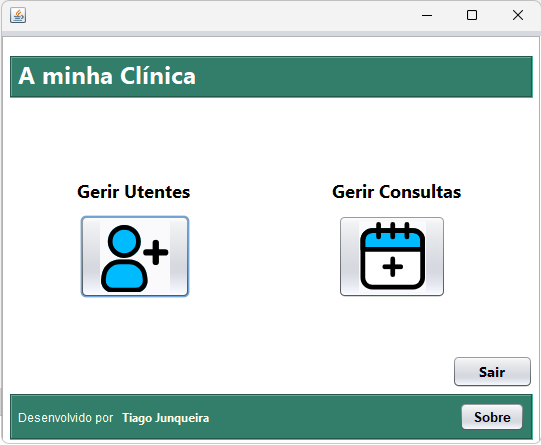
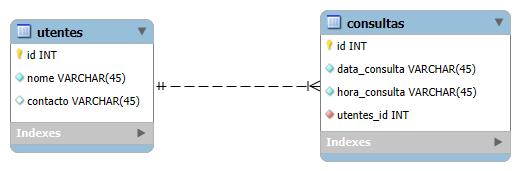

# Nome da App

App em Java para CRUD de utentes e consultas.

## Prints da App

Ecrã inicial: 

Ecrã dos utentes:

Ecrã das consultas:

# Modelo de dados em MYSQL

Modelo de dados:

## Como correr o projeto
1. Usa o ficheiro "db.properties.example" para criares um ficheiro de ligação á tua base de dados.
2. Compila o código Java:
   Podes usar o VSCode ou o NetBeans
3. Executa:
   Seleciona o CORE Starter e RUN o MenuPrincipal.java

## Tecnologias usadas

- Java
- MYSQL

---
