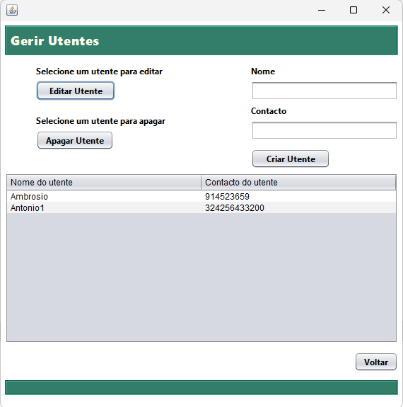
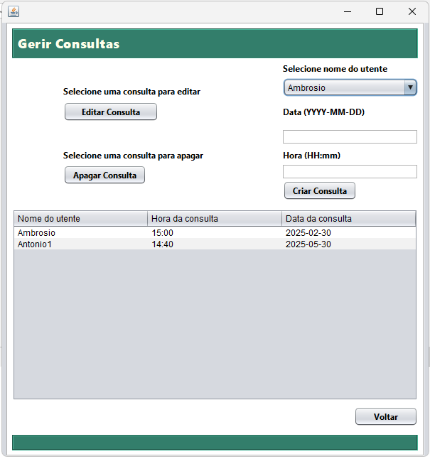

# Nome da App

App em Java desenvolvida por mim.

## Prints da App

Ecrã principal: 

Ecrã dos utentes:

Ecrã das consultas:

## Como correr o projeto

1. Compila o código Java:
   Podes usar o VSCode ou o NetBeans
2. Executa:
   Seleciona o CORE Starter e RUN o MenuPrincipal.java

## Tecnologias usadas

- Java

---
